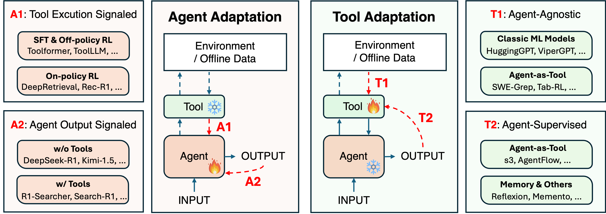

# Awesome Adaptation for Agentic AI
[](https://github.com/sindresorhus/awesome)
[](https://img.shields.io/github/stars/pat-jj/Awesome-Adaptation-for-Agentic-AI?style=social)
[](https://opensource.org/licenses/MIT)
[](https://img.shields.io/badge/PRs-Welcome-red)

<p align="center">
    
</p>

A curated list of papers on adaptation strategies for agentic AI systems. This repository accompanies the survey paper "Adaptation for Agentic AI: A Survey and Roadmap".

## Table of Contents
- [Agent Adaptation](#agent-adaptation)
  - [A1: Tool Execution Signaled](#a1-tool-execution-signaled)
  - [A2: Agent Output Signaled](#a2-agent-output-signaled)
- [Tool Adaptation](#tool-adaptation)
  - [T1: Agent-Agnostic Tool Training](#t1-agent-agnostic-tool-training)
  - [T2: Agent-Supervised Tool Training](#t2-agent-supervised-tool-training)

## Agent Adaptation

### A1: Tool Execution Signaled

#### Earlier Methods: SFT & Off-Policy RL

| Year.Month | Method Name | Paper Name | Venue | Paper Link | Github Link |
|:-----------:|:-----------:|-----------|:-----------:|:-----------:|:-----------:|
| 2024.10 | LeReT | Grounding by Trying: LLMs with Reinforcement Learning-Enhanced Retrieval | ICLR'25 | [paper](https://arxiv.org/abs/2410.23214) | [code](https://github.com/sher222/LeReT) |
| 2024.09 | ToolFlow | ToolFlow: Boosting LLM Tool-Calling Through Natural and Coherent Dialogue Synthesis | NAACL'25 | [paper](https://arxiv.org/abs/2410.18447) | - |
| 2024.06 | RLEF | RLEF: Grounding Code LLMs in Execution Feedback with Reinforcement Learning | ICML'25 | [paper](https://arxiv.org/abs/2410.02089) | - |
| 2024.06 | ToolPrefer LLaMA | Advancing Tool-Augmented Large Language Models: Integrating Insights from Errors in Inference Trees | NeurIPS'24 | [paper](https://arxiv.org/abs/2406.07115) | - |
| 2024.03 | AutoTools | Tool Learning in the Wild: Empowering Language Models as Automatic Tool Agents | WWW'25 | [paper](https://arxiv.org/abs/2405.16533) | [code](https://github.com/mangopy/AutoTools) |
| 2024.01 | NExT | NExT: Teaching Large Language Models to Reason about Code Execution | ICML'24 | [paper](https://arxiv.org/abs/2404.14662) | [code](https://github.com/neulab/next) |
| 2023.07 | ToolLLM | ToolLLM: Facilitating Large Language Models to Master 16000+ Real-world APIs | ICLR'24 | [paper](https://arxiv.org/abs/2307.16789) | [code](https://github.com/OpenBMB/ToolBench) |
| 2023.06 | ToolAlpaca | ToolAlpaca: Generalized Tool Learning for Language Models with 3000 Simulated Cases | arXiv | [paper](https://arxiv.org/abs/2306.05301) | [code](https://github.com/tangqiaoyu/ToolAlpaca) |
| 2023.05 | Gorilla | Gorilla: Large Language Model Connected with Massive APIs | NeurIPS'24 | [paper](https://arxiv.org/abs/2305.15334) | [code](https://github.com/ShishirPatil/gorilla) |
| 2023.05 | TRICE | Making Language Models Better Tool Learners with Execution Feedback |NAACL'24 | [paper](https://arxiv.org/abs/2305.13068) | [code](https://github.com/zjunlp/TRICE) |
| 2023.02 | Toolformer | Toolformer: Language Models Can Teach Themselves to Use Tools | NeurIPS'23 | [paper](https://arxiv.org/abs/2302.04761) | [code](https://github.com/conceptofmind/toolformer) |


#### On-Policy RL-based Methods

| Year.Month | Method Name | Paper Name | Venue | Paper Link | Github Link |
|:-----------:|:-----------:|-----------|:-----------:|:-----------:|:-----------:|
| 2025.10 | olmOCR 2 | olmOCR 2: Unit Test Rewards for Document OCR | arXiv | [paper](https://arxiv.org/abs/2510.19817) | [code](https://github.com/allenai/olmocr) |
| 2025.10 | ToolExpander | ToolExpander: Extending the Frontiers of Tool-Using Reinforcement Learning to Weak LLMs | arXiv | [paper](https://arxiv.org/abs/2510.07737) | - 
| 2025.09 | WebGen-Agent | WebGen-Agent: Enhancing Interactive Website Generation with Multi-Level Feedback and Step-Level Reinforcement Learning | arXiv | [paper](https://arxiv.org/abs/2509.22644) | [code](https://github.com/mnluzimu/WebGen-Agent) ||
| 2025.09 | Tool-R1 | Tool-R1: Sample-Efficient Reinforcement Learning for Agentic Tool Use | arXiv | [paper](https://arxiv.org/abs/2509.12867) | [code](https://github.com/YBYBZhang/Tool-R1) |
| 2025.08 | FTRL | Feedback-Driven Tool-Use Improvements in Large Language Models via Automated Build Environments | arXiv | [paper](https://arxiv.org/abs/2508.08791) | [code](https://github.com/bytedance/FTRL) |
| 2025.05 | R1-Code-Interpreter | R1-Code-Interpreter: Training LLMs to Reason with Code via Supervised and Reinforcement Learning | arXiv | [paper](https://arxiv.org/abs/2505.21668) | [code](https://github.com/yongchao98/R1-Code-Interpreter) |
| 2025.05 | Tool-N1 | Nemotron-Research-Tool-N1: Exploring Tool-Using Language Models with Reinforced Reasoning | arXiv | [paper](https://arxiv.org/abs/2505.00024) | [code](https://github.com/NVlabs/Tool-N1) |
| 2025.04 | SQL-R1 | SQL-R1: Training Natural Language to SQL Reasoning Model by Reinforcement Learning | NeurIPS'25 | [paper](https://arxiv.org/abs/2504.08600) | [code](https://github.com/DataArcTech/SQL-R1) |
| 2025.03 | Rec-R1 | Rec-R1: Bridging Generative Large Language Models and User-Centric Recommendation Systems via Reinforcement Learning | TMLR'25 | [paper](https://openreview.net/forum?id=YBRU9MV2vE) | [code](https://github.com/linjc16/Rec-R1) |
| 2025.03 | ReZero | ReZero: Enhancing LLM Search Ability by Trying One-More-Time | arXiv | [paper](https://arxiv.org/abs/2504.11001) | [code](https://github.com/janhq/ReZero) |
| 2025.03 | Code-R1 | Code-R1: Reproducing R1 for Code with Reliable Rewards | - | - | [code](https://github.com/ganler/code-r1) |
| 2025.02 | DeepRetrieval | DeepRetrieval: Hacking Real Search Engines and Retrievers with Large Language Models via Reinforcement Learning | COLM'25 | [paper](https://arxiv.org/abs/2503.00223) | [code](https://github.com/pat-jj/DeepRetrieval) |

### A2: Agent Output Signaled

#### Adaptation with No Tools

| Year.Month | Method Name | Paper Name | Venue | Paper Link | Github Link |
|:-----------:|:-----------:|-----------|:-----------:|:-----------:|:-----------:|
| 2025.01 | DeepSeek-R1 | DeepSeek-R1: Incentivizes Reasoning in LLMs Through Reinforcement Learning | Nature | [paper](https://www.nature.com/articles/s41586-025-08757-0) | [code](https://github.com/deepseek-ai/DeepSeek-R1) |
| 2025.01 | Kimi-1.5 | Kimi K1.5: Scaling Reinforcement Learning with LLMs | arXiv | [paper](https://arxiv.org/abs/2501.12599) | - |
| 2025.10 | Empower | Training LLM Agents to Empower Humans | arXiv | [paper](https://arxiv.org/abs/2510.13709) | - |
| 2025.10 | KnowRL | KnowRL: Teaching Language Models to Know What They Know | arXiv | [paper](https://arxiv.org/abs/2510.11407) | - |
| 2025.10 | GRACE | GRACE: Generative Representation Learning via Contrastive Policy Optimization | arXiv | [paper](https://arxiv.org/abs/2510.04506) | - |
| 2025.05 | EHRMind | Training LLMs for EHR-Based Reasoning Tasks via Reinforcement Learning | arXiv | [paper](https://arxiv.org/abs/2505.24105) | - |
| 2023.03 | Self-Refine | Self-Refine: Iterative Refinement with Self-Feedback | NeurIPS'23 | [paper](https://arxiv.org/abs/2303.17651) | [code](https://github.com/madaan/self-refine) |
| 2024.09 | SCoRe | Training Language Models to Self-Correct via Reinforcement Learning | ICLR'25 | [paper](https://openreview.net/forum?id=CjwERcAU7w) | - |

#### Adaptation with Tools

| Year.Month | Method Name | Paper Name | Venue | Paper Link | Github Link |
|:-----------:|:-----------:|-----------|:-----------:|:-----------:|:-----------:|
| 2025.03 | R1-Searcher | R1-Searcher: Incentivizing the Search Capability in LLMs via Reinforcement Learning | arXiv | [paper](https://arxiv.org/abs/2503.05592) | - |
| 2025.03 | Search-R1 | Search-R1: Training LLMs to Reason and Leverage Search Engines with Reinforcement Learning | arXiv | [paper](https://arxiv.org/abs/2503.09516) | - |
| 2025.03 | ReSearch | Learning to Reason with Search via Reinforcement Learning | arXiv | [paper](https://arxiv.org/abs/2503.19470) | - |
| 2025.10 | TT-SI | Self-Improving LLM Agents at Test-Time | arXiv | [paper](https://arxiv.org/abs/2510.07841) | - |
| 2025.08 | Agent Lightning | Agent Lightning: Train Any AI Agents with Reinforcement Learning | arXiv | [paper](https://arxiv.org/abs/2508.03680) | - |
| 2024.11 | Re-ReST | Re-ReST: Reflection-Reinforced Self-Training for Language Agents | EMNLP'24 | [paper](https://aclanthology.org/2024.emnlp-main.869/) | - |
| 2025.06 | Self-Challenging | Self-Challenging Language Model Agents | arXiv | [paper](https://arxiv.org/abs/2506.01716) | - |
| 2025.01 | Agent-R | Agent-R: Training Language Model Agents to Reflect via Iterative Self-Training | arXiv | [paper](https://arxiv.org/abs/2501.11425) | - |
| 2025.10 | A²FM | A²FM: An Adaptive Agent Foundation Model for Tool-Aware Hybrid Reasoning | arXiv | [paper](https://arxiv.org/abs/2510.XXXXX) | - |
| 2024.11 | CYCLE | CYCLE: Learning to Self-Refine the Code Generation | OOPSLA'24 | [paper](https://dl.acm.org/doi/10.1145/3689741) | - |
| 2025.04 | ReTool | ReTool: Reinforcement Learning for Strategic Tool Use in LLMs | arXiv | [paper](https://arxiv.org/abs/2504.11536) | - |
| 2025.05 | CodePRM | CodePRM: Execution Feedback-Enhanced Process Reward Model for Code Generation | ACL'25 | [paper](https://aclanthology.org/2025.findings-acl.548/) | - |

## Tool Adaptation

### T1: Agent-Agnostic Tool Training

#### Foundational Systems and Architectures

| Year.Month | Method Name | Paper Name | Venue | Paper Link | Github Link |
|:-----------:|:-----------:|-----------|:-----------:|:-----------:|:-----------:|
| 2023.XX | Neural Operators | Neural Operator: Learning Maps Between Function Spaces | JMLR'23 | [paper](https://jmlr.org/papers/v24/21-1524.html) | - |
| 2023.09 | HuggingGPT | HuggingGPT: Solving AI Tasks with ChatGPT and its Friends in Hugging Face | NeurIPS'23 | [paper](https://arxiv.org/abs/2303.17580) | [code](https://github.com/microsoft/JARVIS) |
| 2023.08 | ViperGPT | ViperGPT: Visual Inference via Python Execution for Reasoning | ICCV'23 | [paper](https://arxiv.org/abs/2303.08128) | [code](https://github.com/cvlab-columbia/viper) |
| 2025.XX | SciToolAgent | SciToolAgent: A Knowledge-Graph-Driven Scientific Agent for Multitool Integration | Nature Comp. Sci.'25 | [paper](https://www.nature.com/articles/s43588-025-00748-w) | - |

#### Categories and Training Methods

| Year.Month | Method Name | Paper Name | Venue | Paper Link | Github Link |
|:-----------:|:-----------:|-----------|:-----------:|:-----------:|:-----------:|
| 2021.01 | CLIP | Learning Transferable Visual Models from Natural Language Supervision | ICML'21 | [paper](https://arxiv.org/abs/2103.00020) | [code](https://github.com/openai/CLIP) |
| 2023.04 | SAM | Segment Anything | ICCV'23 | [paper](https://arxiv.org/abs/2304.02643) | [code](https://github.com/facebookresearch/segment-anything) |
| 2024.06 | SAM-CLIP | SAM-CLIP: Merging Vision Foundation Models Towards Semantic and Spatial Understanding | CVPR'24 | [paper](https://arxiv.org/abs/2310.15308) | - |
| 2023.12 | Whisper | Robust Speech Recognition via Large-Scale Weak Supervision | ICML'23 | [paper](https://arxiv.org/abs/2212.04356) | [code](https://github.com/openai/whisper) |
| 2024.10 | CodeAct | Executable Code Actions Elicit Better LLM Agents | ICML'24 | [paper](https://arxiv.org/abs/2402.01030) | [code](https://github.com/xingyaoww/code-act) |
| 2020.04 | DPR | Dense Passage Retrieval for Open-Domain Question Answering | EMNLP'20 | [paper](https://arxiv.org/abs/2004.04906) | [code](https://github.com/facebookresearch/DPR) |
| 2020.04 | ColBERT | ColBERT: Efficient and Effective Passage Search via Contextualized Late Interaction over BERT | SIGIR'20 | [paper](https://arxiv.org/abs/2004.12832) | [code](https://github.com/stanford-futuredata/ColBERT) |
| 2021.12 | Contriever | Unsupervised Dense Information Retrieval with Contrastive Learning | TMLR'22 | [paper](https://arxiv.org/abs/2112.09118) | [code](https://github.com/facebookresearch/contriever) |
| 2022.12 | e5 | Text Embeddings by Weakly-Supervised Contrastive Pre-training | arXiv | [paper](https://arxiv.org/abs/2212.03533) | [code](https://github.com/microsoft/unilm/tree/master/e5) |
| 2021.07 | AlphaFold2 | Highly Accurate Protein Structure Prediction with AlphaFold | Nature | [paper](https://www.nature.com/articles/s41586-021-03819-2) | [code](https://github.com/deepmind/alphafold) |
| 2023.03 | ESMFold | Evolutionary-Scale Prediction of Atomic-Level Protein Structure with a Language Model | Science | [paper](https://www.science.org/doi/10.1126/science.ade2574) | - |

### T2: Agent-Supervised Tool Training

#### Earlier Methods: From Proxy Signals to Structured Preferences

| Year.Month | Method Name | Paper Name | Venue | Paper Link | Github Link |
|:-----------:|:-----------:|-----------|:-----------:|:-----------:|:-----------:|
| 2023.02 | REPLUG | REPLUG: Retrieval-Augmented Black-Box Language Models | NAACL'24 | [paper](https://arxiv.org/abs/2301.12652) | - |
| 2023.05 | AAR | Augmentation-Adapted Retriever Improves Generalization of Language Models as Generic Plug-In | ACL'23 | [paper](https://arxiv.org/abs/2305.17331) | - |
| 2023.10 | RA-DIT | RA-DIT: Retrieval-Augmented Dual Instruction Tuning | ICLR'23 | [paper](https://arxiv.org/abs/2310.01352) | - |
| 2024.01 | LLM-R | Learning to Retrieve In-Context Examples for Large Language Models | EACL'24 | [paper](https://arxiv.org/abs/2307.07164) | - |
| 2023.05 | UPRISE | UPRISE: Universal Prompt Retrieval for Improving Zero-Shot Evaluation | EMNLP'23 | [paper](https://arxiv.org/abs/2303.08518) | [code](https://github.com/microsoft/LMOps) |
| 2024.05 | BGM | Bridging the Preference Gap between Retrievers and LLMs | ACL'24 | [paper](https://arxiv.org/abs/2401.06954) | - |
| 2025.05 | RETPO | Ask Optimal Questions: Aligning Large Language Models with Retriever's Preference | NAACL'25 | [paper](https://arxiv.org/abs/2402.11827) | - |

#### Agent-as-Tool: Agentic Sub-Agents

| Year.Month | Method Name | Paper Name | Venue | Paper Link | Github Link |
|:-----------:|:-----------:|-----------|:-----------:|:-----------:|:-----------:|
| 2025.05 | s3 | s3: You Don't Need That Much Data to Train a Search Agent via RL | EMNLP'25 | [paper](https://arxiv.org/abs/2505.14146) | [code](https://github.com/pat-jj/s3) |
| 2025.05 | DynamicRAG | DynamicRAG: Leveraging Outputs of Large Language Model as Feedback for Dynamic Reranking | arXiv | [paper](https://arxiv.org/abs/2505.07233) | - |
| 2025.08 | AI-SearchPlanner | AI-SearchPlanner: Modular Agentic Search via Pareto-Optimal Multi-Objective Reinforcement Learning | arXiv | [paper](https://arxiv.org/abs/2508.20368) | - |
| 2025.08 | QAgent | QAgent: A Modular Search Agent with Interactive Query Understanding | arXiv | [paper](https://arxiv.org/abs/2510.08383) | - |
| 2025.10 | AgentFlow | In-the-Flow Agentic System Optimization for Effective Planning and Tool Use | arXiv | [paper](https://arxiv.org/abs/2510.05592) | - |

#### Agentic Memory and Others

| Year.Month | Method Name | Paper Name | Venue | Paper Link | Github Link |
|:-----------:|:-----------:|-----------|:-----------:|:-----------:|:-----------:|
| 2025.08 | Memento | Memento: Fine-Tuning LLM Agents Without Fine-Tuning LLMs | arXiv | [paper](https://arxiv.org/abs/2508.16153) | - |
| 2023.12 | ToolkenGPT | ToolkenGPT: Augmenting Frozen Language Models with Massive Tools via Tool Embeddings | NeurIPS'23 | [paper](https://arxiv.org/abs/2305.11554) | - |
| 2024.05 | UniMuR | Unified Embeddings for Multimodal Retrieval via Frozen LLMs | EACL'24 Findings | [paper](https://arxiv.org/abs/2403.12838) | - |
| 2024.06 | DIFO | Source-Free Domain Adaptation with Frozen Multimodal Foundation Model | CVPR'24 | [paper](https://arxiv.org/abs/2311.16510) | - |
| 2024.06 | V2L Tokenizer | Beyond Text: Frozen Large Language Models in Visual Signal Comprehension | CVPR'24 | [paper](https://arxiv.org/abs/2403.07874) | - |
| 2025.06 | Sysformer | Sysformer: Safeguarding Frozen Large Language Models with Adaptive System Prompts | arXiv | [paper](https://arxiv.org/abs/2506.15751) | - |

## Citation

If you find this repository useful, please consider citing our survey:

```bibtex
@article{adaptation_agentic_ai_2025,
  title={Adaptation for Agentic AI: A Survey and Roadmap},
  author={[Authors]},
  journal={arXiv preprint arXiv:XXXX.XXXXX},
  year={2025}
}
```

## Contributing

We welcome contributions! Please feel free to submit a Pull Request to add new papers or update existing entries.

## License

This project is licensed under the MIT License - see the LICENSE file for details.
