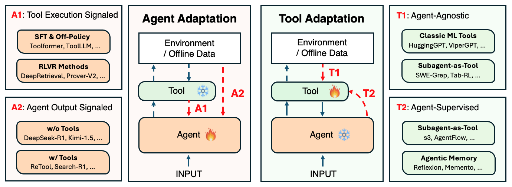
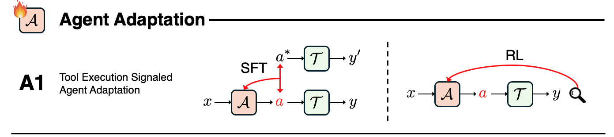
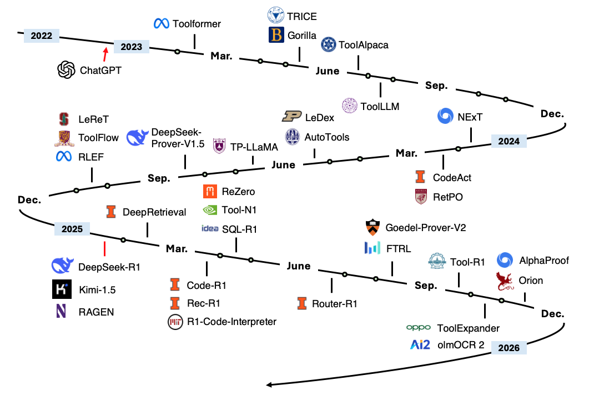
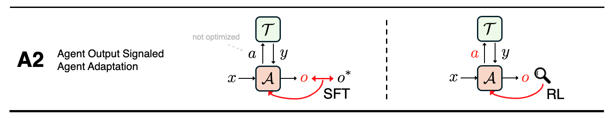
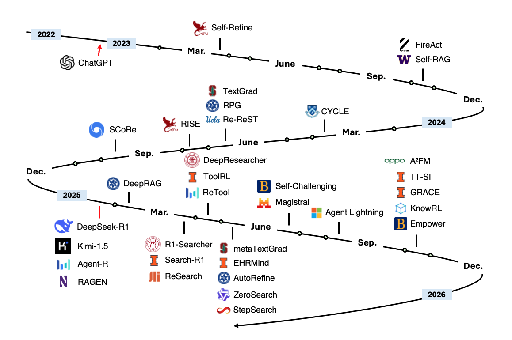
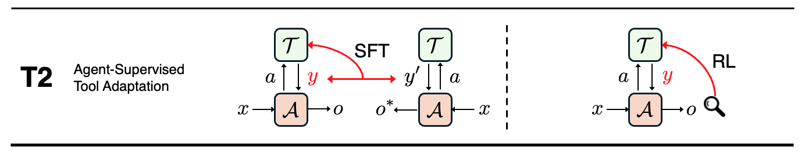
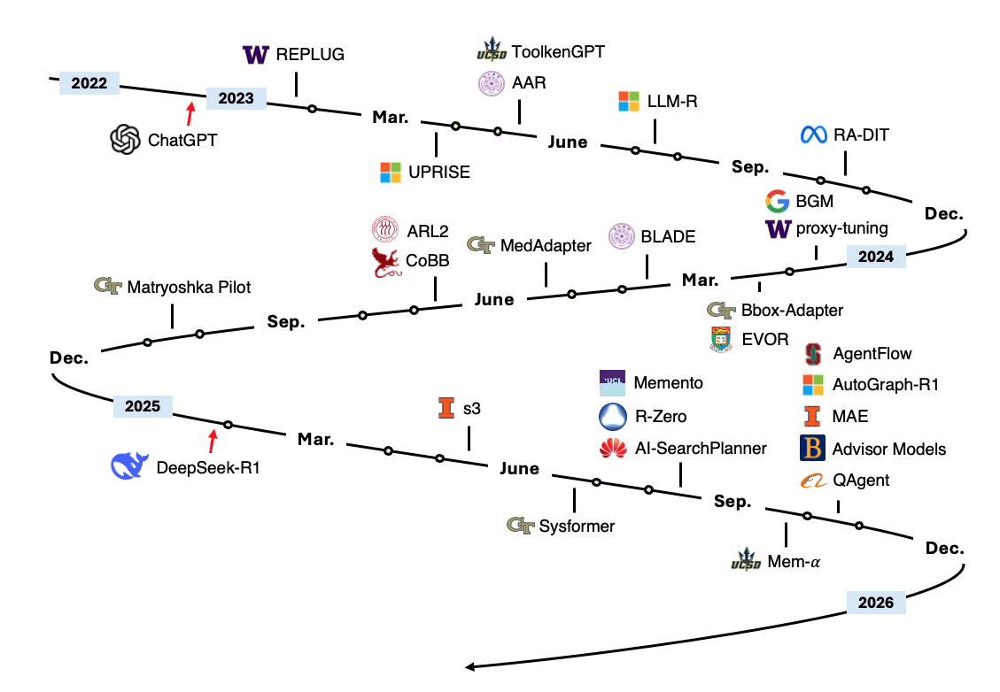

# Awesome Adaptation of Agentic AI
[](https://github.com/sindresorhus/awesome)
[](https://img.shields.io/github/stars/pat-jj/Awesome-Adaptation-of-Agentic-AI?style=social)
[](https://creativecommons.org/licenses/by-nc-nd/4.0/)
[](https://img.shields.io/badge/PRs-Welcome-red)
[](https://github.com/pat-jj/Awesome-Adaptation-of-Agentic-AI/blob/main/paper.pdf)


<p align="center">
    
</p>

A curated list of papers on adaptation strategies of agentic AI systems. This repository accompanies the paper "Adaptation of Agentic AI" (Ongoing Work).

**Cite this paper:**
```
@article{jiang2025adaptation,
  title        = {Adaptation of Agentic AI},
  author       = {Jiang, Pengcheng and Lin, Jiacheng and Shi, Zhiyi and Wang, Zifeng and He, Luxi and Wu, Yichen and Zhong, Ming and Zhang, Qizheng and Song, Peiyang and Wang, Heng and Xu, Xueqiang and Xu, Hanwen and Han, Pengrui and Zhang, Dylan and Sun, Jiashuo and Yang, Chaoqi and Qian, Kun and Wang, Tian and Hu, Changran and Li, Manling and Li, Quanzheng and Wang, Sheng and Peng, Hao and You, Jiaxuan and Liu, Liyuan and Lu, Pan and Zhang, Yu and Ji, Heng and Choi, Yejin and Song, Dawn and Sun, Jimeng and Han, Jiawei},
  howpublished = {https://github.com/pat-jj/Awesome-Adaptation-of-Agentic-AI},
  year         = {2025}
}
```


## Table of Contents
- [Agent Adaptation](#agent-adaptation)
  - [A1: Tool Execution Signaled](#a1-tool-execution-signaled)
  - [A2: Agent Output Signaled](#a2-agent-output-signaled)
- [Tool Adaptation](#tool-adaptation)
  - [T1: Agent-Agnostic Tool Adaptation](#t1-agent-agnostic-tool-adaptation)
  - [T2: Agent-Supervised Tool Adaptation](#t2-agent-supervised-tool-adaptation)

---

## Agent Adaptation

### A1: Tool Execution Signaled Agent Adaptation


<p align="center">
    
</p>

Development Timeline:
<p align="center">
    
</p>

#### RL-based Methods

| Time | Method | Venue | Task(s) | Tool(s) | Agent Backbone | Tuning |
|------|--------|-------|---------|---------|----------------|--------|
| 2025.11 | Orion | arXiv<br> [Paper](https://arxiv.org/abs/2511.07581) | IR | Retrievers | LFM2 | GRPO |
| 2025.10 | olmOCR2 | arXiv<br> [Paper](https://arxiv.org/abs/2510.19817)<br> [Code](https://github.com/allenai/olmocr) | Document OCR | Synthetic Document Verifier | Qwen2.5-VL | SFT, GRPO |
| 2025.10 | AlphaProof | Nature’25<br> [Paper](https://www.nature.com/articles/s41586-025-09833-y) | Formal Theorem Proving | Lean Solver | Transformer (3B Enc-Dec) | SFT, AlphaZero, TTRL |
| 2025.10 | ToolExpander | arXiv<br> [Paper](https://arxiv.org/abs/2510.07737) | Tool-Calling | Various APIs | Qwen2.5 | SFT, GRPO |
| 2025.09 | WebGen-Agent | arXiv<br> [Paper](https://arxiv.org/abs/2509.22644)<br> [Code](https://github.com/mnluzimu/WebGen-Agent) | Website Generation | VLM, GUI Agent, Code Executor | Various Models | SFT, Step-GRPO |
| 2025.09 | Tool-R1 | arXiv<br> [Paper](https://arxiv.org/abs/2509.12867)<br> [Code](https://github.com/YBYBZhang/Tool-R1) | General Tool-Augmented Reasoning, Multimodal QA | Code Execution, Multimedia Tools | Qwen2.5 | GRPO |
| 2025.08 | FTRL | arXiv<br> [Paper](https://arxiv.org/abs/2508.08791)<br> [Code](https://github.com/bytedance/FTRL) | Multi-Step Tool-Use | Simulated APIs | Qwen3 | GRPO |
| 2025.08 | Goedel-Prover-V2 | arXiv<br> [Paper](https://arxiv.org/abs/2508.03613)<br> [Code](https://github.com/Goedel-LM/Goedel-Prover-V2) | Formal Theorem Proving | Lean Compiler | Qwen3 | SFT, GRPO |
| 2025.06 | Router-R1 | NeurIPS'25<br> [Paper](https://arxiv.org/abs/2506.09033)<br> [Code](https://github.com/ulab-uiuc/Router-R1) | Multi-Round Routing | LLM Routing Pool | Qwen2.5, LLaMA3.2 | PPO |
| 2025.05 | R1-Code-Interpreter | arXiv<br> [Paper](https://arxiv.org/abs/2505.21668)<br> [Code](https://github.com/yongchao98/R1-Code-Interpreter) | Coding | Code Execution Sandbox | Qwen2.5 | GRPO |
| 2025.05 | Tool-N1 | arXiv<br> [Paper](https://arxiv.org/abs/2505.00024)<br> [Code](https://github.com/NVlabs/Tool-N1) | Tool-Calling | Various APIs | Qwen2.5 | GRPO |
| 2025.04 | SQL-R1 | NeurIPS'25<br> [Paper](https://arxiv.org/abs/2504.08600)<br> [Code](https://github.com/DataArcTech/SQL-R1) | Text2SQL Search | SQL Engine | Qwen2.5, OmniSQL | SFT, GRPO |
| 2025.03 | Rec-R1 | TMLR'25<br> [Paper](https://openreview.net/forum?id=YBRU9MV2vE)<br> [Code](https://github.com/linjc16/Rec-R1) | Recommendation Optimization | Recommendation System | Qwen2.5, LLaMA3.2 | GRPO |
| 2025.03 | ReZero | arXiv<br> [Paper](https://arxiv.org/abs/2504.11001)<br> [Code](https://github.com/janhq/ReZero) | Web Search, IR | Web Search Engine | LLaMA3.2 | GRPO |
| 2025.03 | Code-R1 | ---<br> [Code](https://github.com/ganler/code-r1) | Coding | Code Executor | Qwen2.5 | GRPO |
| 2025.02 | DeepRetrieval | COLM'25<br> [Paper](https://arxiv.org/abs/2503.00223)<br> [Code](https://github.com/pat-jj/DeepRetrieval) | Web Search, IR, Text2SQL | Search Engine, Retrievers, SQL exec. | Qwen2.5, LLaMA3.2 | PPO, GRPO |
| 2025.01 | DeepSeek-R1-Zero (Code) | Nature<br> [Paper](https://arxiv.org/abs/2501.12948) | Coding | Code Executor | DeepSeek-V3-Base | GRPO |
| 2024.10 | RLEF | ICML'25<br> [Paper](https://arxiv.org/abs/2410.02089) | Coding | Code Executor | LLaMA3.1 | PPO |
| 2024.08 | DeepSeek-Prover-V1.5 | ICLR’25<br> [Paper](https://arxiv.org/abs/2408.08152)<br> [Code](https://github.com/deepseek-ai/DeepSeek-Prover-V1.5) | Formal Theorem Proving | Lean 4 Prover | DeepSeek-Prover-V1.5-RL | SFT, GRPO |
| 2024.05 | LeDex | NeurIPS'24<br> [Paper](https://arxiv.org/abs/2405.18649) | Coding | Code Executor | StarCoder & CodeLlaMA | SFT, PPO |


#### SFT & DPO Methods

| Time | Method | Venue | Task(s) | Tool(s) | Agent Backbone | Tuning |
|------|--------|-------|---------|---------|----------------|--------|
| 2024.10 | LeReT | ICLR'25<br> [Paper](https://arxiv.org/abs/2410.23214)<br> [Code](https://github.com/sher222/LeReT) | IR | Dense Retriever | LLaMA3, Gemma2 | DPO-like (IPO) |
| 2024.10 | ToolFlow | NAACL'25<br> [Paper](https://arxiv.org/abs/2410.18447) | Tool-Calling | Various APIs | LLaMA3.1 | SFT |
| 2024.06 | TP-LLaMA | NeurIPS'24<br> [Paper](https://arxiv.org/abs/2406.07115) | Tool-Calling | Various APIs | LLaMA2 | SFT, DPO |
| 2024.05 | AutoTools | WWW'25<br> [Paper](https://arxiv.org/abs/2405.16533)<br> [Code](https://github.com/mangopy/AutoTools) | Automated Tool-Calling | Various APIs | GPT4, LLaMA3, Mistral | SFT |
| 2024.03 | CYCLE | OOPSLA'24<br> [Paper](https://arxiv.org/abs/2403.18746) | Coding | Code Executor | CodeGen, StarCoder | SFT |
| 2024.02 | RetPO | NAACL'25<br> [Paper](https://arxiv.org/abs/2402.11827)<br> [Code](https://github.com/dmis-lab/RetPO) | IR | Retriever | LLaMA2-7B | SFT, DPO |
| 2024.02 | CodeAct | ICML'24<br> [Paper](https://arxiv.org/abs/2402.01030)<br> [Code](https://github.com/xingyaoww/code-act) | Coding | Code Executor | LLaMA2, Mistral | SFT |
| 2024.01 | NExT | ICML'24<br> [Paper](https://arxiv.org/abs/2404.14662) | Program Repair | Code Executor | PaLM2 | SFT |
| 2023.07 | ToolLLM | ICLR'24<br> [Paper](https://arxiv.org/abs/2307.16789)<br> [Code](https://github.com/OpenBMB/ToolBench) | Tool-Calling, API Planning, Multi-Tool Reasoning | Real-World APIs | LLaMA, Vicuna | SFT |
| 2023.06 | ToolAlpaca | arXiv<br> [Paper](https://arxiv.org/abs/2306.05301)<br> [Code](https://github.com/tangqiaoyu/ToolAlpaca) | Multi-Turn Tool-Use | Simulated APIs | Vicuna | SFT |
| 2023.05 | Gorilla | NeurIPS'24<br> [Paper](https://arxiv.org/abs/2305.15334)<br> [Code](https://github.com/ShishirPatil/gorilla) | Tool-Calling, API Retrieval | Various APIs | LLaMA | SFT |
| 2023.05 | TRICE | NAACL'24<br> [Paper](https://arxiv.org/abs/2305.13068)<br> [Code](https://github.com/zjunlp/TRICE) | Math Reasoning, QA, Multilingual QA, Knowledge Retrieval | Calculator, WikiSearch, Atlas QA Model, NLLB Translator | ChatGLM, Alpaca, Vicuna | SFT |
| 2023.02 | Toolformer | NeurIPS'23<br> [Paper](https://arxiv.org/abs/2302.04761)<br> [Code](https://github.com/conceptofmind/toolformer) | QA, Math | Calculator, QA system, Search Engine, Translation System, Calendar | GPT-J | SFT |

---

<br>
<br>

### A2: Agent Output Signaled Agent Adaptation

<p align="center">
    
</p>

Development Timeline:
<p align="center">
    
</p>


#### Methods with Tools

| Time | Method | Venue | Task(s) | Tool(s) | Agent Backbone | Tuning |
|------|--------|-------|---------|---------|----------------|--------|
| 2025.10 | TT-SI | arXiv<br> [Paper](https://arxiv.org/abs/2510.07841) | Tool Calling | Various APIs | Qwen2.5 | Test-Time Fine-Tuning |
| 2025.10 | A²FM | arXiv<br> [Paper](https://arxiv.org/abs/2510.12838)<br> [Code](https://github.com/OPPO-PersonalAI/Adaptive_Agent_Foundation_Models) | Web Navigation, Math, QA | Search Engine, Crawl, Code Executor | Qwen2.5 | APO, GRPO |
| 2025.08 | MedResearcher-R1 | arXiv<br> [Paper](https://arxiv.org/abs/2508.14880)<br> [Code](https://github.com/AQ-MedAI/MedResearcher-R1) | Medical Multi-hop QA | Medical Retriever, Web Search API, Document Reader | MedResearcher-R1 | SFT, GRPO |
| 2025.08 | Agent Lightning | arXiv<br> [Paper](https://arxiv.org/abs/2508.03680)<br> [Code](https://github.com/microsoft/agent-lightning) | Text-to-SQL, RAG, Math | SQL Executor, Retriever, Calculator | LLaMA3.2 | LightningRL |
| 2025.07 | CodePRM | ACL'25<br> [Paper](https://aclanthology.org/2025.findings-acl.428/) | Coding | Code Executor | Qwen2.5-Coder | SFT |
| 2025.07 | DynaSearcher | arXiv<br> [Paper](https://arxiv.org/abs/2507.17365)<br> [Code](https://modelscope.cn/home) | Multi-Hop QA, RAG | Document Search, KG Search | Qwen2.5, LLaMA3.1 | GRPO |
| 2025.06 | MMSearch-R1 | arXiv<br> [Paper](https://arxiv.org/abs/2506.20670)<br> [Code](https://github.com/EvolvingLMMs-Lab/multimodal-search-r1) | Web Browsing, QA, Multimodal Search | Image Search, Web Browsing, Retriever | Qwen2.5 | REINFORCE, SFT |
| 2025.06 | Self-Challenging | arXiv<br> [Paper](https://arxiv.org/abs/2506.01716) | Web Browsing, Calculation, Retail, Airline | Code Interpreter, Web Browser, Database APIs | LLaMA3.1 | REINFORCE, SFT |
| 2025.05 | StepSearch | EMNLP'25<br> [Paper](https://arxiv.org/abs/2505.15107)<br> [Code](https://github.com/Zillwang/StepSearch) | Multi-Hop QA | Search Engine, Retriever | Qwen2.5 | StePPO |
| 2025.05 | ZeroSearch | arXiv<br> [Paper](https://arxiv.org/abs/2505.04588)<br> [Code](https://github.com/Alibaba-NLP/ZeroSearch) | Multi-Hop QA, QA | Search Engine, Web Search | Qwen2.5, LLaMA3.2 | REINFORCE, GPRO, PPO, SFT |
| 2025.05 | AutoRefine | NeurIPS'25<br> [Paper](https://arxiv.org/abs/2505.11277)<br> [Code](https://github.com/syr-cn/AutoRefine) | Multi-Hop QA, QA | Retriever | Qwen2.5 | GRPO |
| 2025.04 | ReTool | arXiv<br> [Paper](https://arxiv.org/abs/2504.11536)<br> [Code](https://github.com/ReTool-RL/ReTool) | Math | Code Interpreter | Qwen2.5 | PPO |
| 2025.04 | ToolRL | arXiv<br> [Paper](https://arxiv.org/abs/2504.13958)<br> [Code](https://github.com/qiancheng0/ToolRL) | Tool Calling | Various Tools | Various Models | GRPO |
| 2025.04 | DeepResearcher | arXiv<br> [Paper](https://arxiv.org/abs/2504.03160)<br> [Code](https://github.com/GAIR-NLP/DeepResearcher) | QA, Multi-Hop Reasoning, Deep Research | Web Search API, Web Browser | Qwen2.5 | GRPO |
| 2025.03 | ReSearch | NeurIPS'25<br> [Paper](https://arxiv.org/abs/2503.19470)<br> [Code](https://github.com/Agent-RL/ReCall) | QA | Search Engine, Retriever | Qwen2.5 | GRPO |
| 2025.03 | Search-R1 | COLM'25<br> [Paper](https://arxiv.org/abs/2503.09516)<br> [Code](https://github.com/PeterGriffinJin/Search-R1) | QA | Search Engine, Retriever | Qwen2.5 | PPO, GRPO |
| 2025.03 | R1-Searcher | arXiv<br> [Paper](https://arxiv.org/abs/2503.05592)<br> [Code](https://github.com/RUCAIBox/R1-Searcher) | QA | Retriever | LLaMA3.1, Qwen2.5 | REINFORCE++ |
| 2025.02 | RAS | arXiv<br> [Paper](https://arxiv.org/abs/2502.10996)<br> [Code](https://github.com/pat-jj/RAS) | QA | Retriever | LLaMA2, LLaMA3.2 | SFT |
| 2025.01 | Agent-R | arXiv<br> [Paper](https://arxiv.org/abs/2501.11425)<br> [Code](https://github.com/ByteDance-Seed/Agent-R) | Various Tasks | Monte Carlo Tree Search | Qwen2.5, LLaMA3.2 | SFT |
| 2024.06 | Re-ReST | EMNLP'24<br> [Paper](https://arxiv.org/abs/2406.01495)<br> [Code](https://github.com/PlusLabNLP/Re-ReST) | Multi-Hop QA, VQA, Sequential Decision, Coding | Various APIs | Various Models | DPO |
| 2024.06 | RPG | EMNLP'24<br> [Paper](https://arxiv.org/abs/2406.14979)<br> [Code](https://github.com/haruhi-sudo/RPG) | RAG, QA, Multi-hop Reasoning | Search Engine, Retriever | LLaMA2, GPT3.5 | SFT |
| 2023.10 | Self-RAG | ICLR'24<br> [Paper](https://arxiv.org/abs/2310.11511)<br> [Code](https://github.com/AkariAsai/self-rag) | RAG, QA, Fact Verification | Retriever | LLaMA2 | SFT |
| 2023.10 | FireAct | arXiv<br> [Paper](https://arxiv.org/abs/2310.05915)<br> [Code](https://fireact-agent.github.io) | QA | Search API | GPT3.5, LLaMA2, CodeLLaMA | SFT |

#### Methods without Tools

| Time | Method | Venue | Task(s) | Tool(s) | Agent Backbone | Tuning |
|------|--------|-------|---------|---------|----------------|--------|
| 2025.10 | Empower | arXiv<br> [Paper](https://arxiv.org/abs/2510.13709)<br> [Code](https://github.com/festusev/codegen_empowerment/tree/main) | Coding | --- | Gemma3 | SFT |
| 2025.10 | KnowRL | arXiv<br> [Paper](https://arxiv.org/abs/2510.11407)<br> [Code](https://anonymous.4open.science/r/KnowRL-5BF0) | Knowledge calibration | --- | LLaMA3.1, Qwen2.5 | REINFORCE++ |
| 2025.10 | GRACE | arXiv<br> [Paper](https://arxiv.org/abs/2510.04506)<br> [Code](https://github.com/GasolSun36/GRACE) | Embedding Tasks | --- | Qwen2.5, Qwen3, LLaMA3.2 | GRPO |
| 2025.06 | Magistral | arXiv<br> [Paper](https://arxiv.org/abs/2506.10910) | Math, Coding | --- | Magistral | PPO, GRPO |
| 2025.05 | EHRMind | arXiv<br> [Paper](https://arxiv.org/abs/2505.24105)<br> [Code](https://github.com/linjc16/EHRMind) | EHR-based Reasoning | --- | LLaMA3 | SFT, GRPO |
| 2025.01 | Kimi k1.5 | arXiv<br> [Paper](https://arxiv.org/abs/2501.12948)<br> [Code](https://github.com/MoonshotAI/Kimi-k1.5) | Math, Coding | --- | Kimi k1.5 | GRPO |
| 2025.01 | DeepSeek-R1-Zero (Math) | Nature<br> [Paper](https://arxiv.org/abs/2501.12948) | Math | --- | DeepSeek-V3 | GRPO |
| 2024.09 | SCoRe | ICLR'25<br> [Paper](https://arxiv.org/abs/2409.12917)<br> [Code](https://github.com/BY571/SCoRe) | Math, Coding, QA | --- | Gemini1.0 Pro, Gemini1.5 Flash | REINFORCE |
| 2024.07 | RISE | NeurIPS'24<br> [Paper](https://arxiv.org/abs/2407.18219)<br> [Code](https://github.com/cmu-mind/RISE) | Math | --- | LLaMA2, LLaMA3, Mistral | SFT |
| 2024.06 | TextGrad | Nature<br> [Paper](https://arxiv.org/abs/2406.07496)<br> [Code](https://github.com/zou-group/textgrad) | Various Tasks | --- | GPT3.5, GPT4o | Prompt Tuning |
| 2023.03 | Self-Refine | NeurIPS'23<br> [Paper](https://arxiv.org/abs/2303.17651)<br> [Code](https://github.com/madaan/self-refine) | Dialogue, Math, Coding | --- | GPT3.5, GPT4, CODEX | Test-Time Prompting |

---

## Tool Adaptation

### T1: Agent-Agnostic Tool Adaptation
<p align="center">
    
</p>


#### Foundational Systems and Architectures

| Year.Month | Method Name | Venue | Paper Name |
|:-----------:|:-----------:|:-----------|:-----------|
| 2021.08 | Neural Operators | JMLR'23<br> [Paper](https://jmlr.org/papers/v24/21-1524.html) | Neural Operator: Learning Maps Between Function Spaces |
| 2023.09 | HuggingGPT | NeurIPS'23<br> [Paper](https://arxiv.org/abs/2303.17580)<br> [Code](https://github.com/microsoft/JARVIS) | HuggingGPT: Solving AI Tasks with ChatGPT and its Friends in Hugging Face |
| 2023.08 | ViperGPT | ICCV'23<br> [Paper](https://arxiv.org/abs/2303.08128)<br> [Code](https://github.com/cvlab-columbia/viper) | ViperGPT: Visual Inference via Python Execution for Reasoning |
| 2025.07 | SciToolAgent | Nature Comp. Sci.'25<br> [Paper](https://arxiv.org/abs/2507.20280) | SciToolAgent: A Knowledge-Graph-Driven Scientific Agent for Multitool Integration |
#### Categories and Training Methods

| Year.Month | Method Name | Venue | Paper Name |
|:-----------:|:-----------:|:-----------|:-----------|
| 2021.01 | CLIP | ICML'21<br> [Paper](https://arxiv.org/abs/2103.00020)<br> [Code](https://github.com/openai/CLIP) | Learning Transferable Visual Models from Natural Language Supervision |
| 2023.04 | SAM | ICCV'23<br> [Paper](https://arxiv.org/abs/2304.02643)<br> [Code](https://github.com/facebookresearch/segment-anything) | Segment Anything |
| 2024.06 | SAM-CLIP | CVPR'24<br> [Paper](https://arxiv.org/abs/2310.15308) | SAM-CLIP: Merging Vision Foundation Models Towards Semantic and Spatial Understanding |
| 2023.12 | Whisper | ICML'23<br> [Paper](https://arxiv.org/abs/2212.04356)<br> [Code](https://github.com/openai/whisper) | Robust Speech Recognition via Large-Scale Weak Supervision |
| 2024.10 | CodeAct | ICML'24<br> [Paper](https://arxiv.org/abs/2402.01030)<br> [Code](https://github.com/xingyaoww/code-act) | Executable Code Actions Elicit Better LLM Agents |
| 2020.04 | DPR | EMNLP'20<br> [Paper](https://arxiv.org/abs/2004.04906)<br> [Code](https://github.com/facebookresearch/DPR) | Dense Passage Retrieval for Open-Domain Question Answering |
| 2020.04 | ColBERT | SIGIR'20<br> [Paper](https://arxiv.org/abs/2004.12832)<br> [Code](https://github.com/stanford-futuredata/ColBERT) | ColBERT: Efficient and Effective Passage Search via Contextualized Late Interaction over BERT |
| 2021.12 | Contriever | TMLR'22<br> [Paper](https://arxiv.org/abs/2112.09118)<br> [Code](https://github.com/facebookresearch/contriever) | Unsupervised Dense Information Retrieval with Contrastive Learning |
| 2022.12 | e5 | arXiv<br> [Paper](https://arxiv.org/abs/2212.03533)<br> [Code](https://github.com/microsoft/unilm/tree/master/e5) | Text Embeddings by Weakly-Supervised Contrastive Pre-training |
| 2021.07 | AlphaFold2 | Nature<br> [Paper](https://www.nature.com/articles/s41586-021-03819-2)<br> [Code](https://github.com/deepmind/alphafold) | Highly Accurate Protein Structure Prediction with AlphaFold |
| 2023.03 | ESMFold | Science<br> [Paper](https://www.science.org/doi/10.1126/science.ade2574) | Evolutionary-Scale Prediction of Atomic-Level Protein Structure with a Language Model |
---

<br>
<br>

### T2: Agent-Supervised Tool Adaptation

<p align="center">
    
</p>

Development Timeline:
<p align="center">
    
</p>

| Time | Method | Venue | Task(s) | Tool Backbone | Agent Backbone | Tuning |
|------|--------|-------|---------|---------------|----------------|--------|
| 2025.10 | QAgent | arXiv<br> [Paper](https://arxiv.org/abs/2510.08383)<br> [Code](https://github.com/LivingFutureLab/QAgent) | QA, RAG | Qwen2.5-3B | Qwen-7B | GRPO |
| 2025.10 | AgentFlow | arXiv<br> [Paper](https://arxiv.org/abs/2510.05592)<br> [Code](https://github.com/lupantech/AgentFlow) | Web Search, Planning, Reasoning, Math | Qwen2.5-7B | Qwen2.5-7B | Flow-GRPO |
| 2025.10 | Advisor Models | arXiv<br> [Paper](https://arxiv.org/abs/2510.02453)<br> [Code](https://github.com/az1326/advisor-models) | Math, Reasoning | Qwen2.5-7B, Qwen3-8B | GPT-4o-Mini, GPT-5, Claude4-Sonnet, GPT-4.1-Mini | GRPO |
| 2025.10 | AutoGraph-R1 | arXiv<br> [Paper](https://arxiv.org/abs/2510.15339)<br> [Code](https://github.com/HKUST-KnowComp/AutoGraph-R1) | KG Construction, RAG | KG Constructor (Qwen2.5-3B/7B) | Frozen RAG Generator (Qwen2.5-7B) | GRPO |
| 2025.10 | MAE | arXiv<br> [Paper](https://arxiv.org/abs/2510.23595)<br> [Code](https://github.com/ulab-uiuc/Multi-agent-Evolve) | Math, Coding, Commonsense Reasoning | Qwen2.5-3B | Qwen2.5-3B | REINFORCE++ |
| 2025.09 | Mem-α | arXiv<br> [Paper](https://arxiv.org/abs/2509.25911)<br> [Code](https://github.com/wangyu-ustc/Mem-alpha) | Retrieval, Test-Time Learning, Long-Range Understanding | Qwen3-4B | Qwen3-4B, Qwen3-32B, GPT-4.1-Mini | GRPO |
| 2025.08 | AI-SearchPlanner | arXiv<br> [Paper](https://arxiv.org/abs/2508.20368) | Web QA | Qwen3-32b | Qwen2.5-7B | PPO |
| 2025.08 | Memento | arXiv<br> [Paper](https://arxiv.org/abs/2508.16153)<br> [Code](https://github.com/Agent-on-the-Fly/Memento) | Long-Horizon Reasoning, Web Research, QA, Academic Reasoning | Q-function (two-layer MLPs) | GPT-4.1 | Soft Q-Learning |
| 2025.08 | R-Zero | arXiv<br> [Paper](https://arxiv.org/abs/2508.05004)<br> [Code](https://github.com/Chengsong-Huang/R-Zero) | Math, Reasoning | Qwen3-4B, Qwen3-8B, OctoThinker-3B, OctoThinker-8B | Qwen3-4B, Qwen3-8B, OctoThinker-3B, OctoThinker-8B | GRPO |
| 2025.06 | Sysformer | arXiv<br> [Paper](https://arxiv.org/abs/2506.15751) | QA, RAG | Small Transformer | LLaMA-2-7B, LLaMA-3.1-8B, Mistral-7B, Phi-3.5-mini, Zephyr-7B-beta | Supervised Learning |
| 2025.05 | s3 | EMNLP'25<br> [Paper](https://arxiv.org/abs/2505.14146)<br> [Code](https://github.com/pat-jj/s3) | QA, RAG | Qwen2.5-7B | Qwen2.5-7B, Qwen2.5-14B, Claude-3-Haiku | PPO |
| 2024.10 | Matryoshka Pilot | NeurIPS'25<br> [Paper](https://arxiv.org/abs/2410.20749)<br> [Code](https://github.com/lichangh20/Matryoshka) | Math, Planning, Reasoning | LLaMA3-8B, Qwen2.5-7B | GPT-4o-Mini, GPT-3.5-Turbo | DPO, IDPO |
| 2024.06 | CoBB | EMNLP'24<br> [Paper](https://arxiv.org/abs/2406.18695)<br> [Code](https://github.com/bbuing9/CoBB) | QA, Math | Mistral-7b-inst-v2 | GPT-3.5-Turbo, Claude-3-Haiku, Phi-3-mini-4k-inst, Gemma-1.1-7B-it, Mistral-7B-inst-v2 | SFT, ORPO |
| 2024.05 | Medadapter | EMNLP'24<br> [Paper](https://arxiv.org/abs/2405.03000)<br> [Code](https://github.com/wshi83/MedAdapter) | Medical QA, NLI, RQE | BERT-Base-Uncased | GPT-3.5-Turbo | SFT, BPO |
| 2024.03 | BLADE | AAAI'25<br> [Paper](https://arxiv.org/abs/2403.18365)<br> [Code](https://github.com/CSHaitao/BLADE) | Domain-Specific QA | BLOOMZ-1b7 | ChatGPT, ChatGLM, Baichuan, Qwen | SFT, BPO |
| 2024.02 | ARL2 | ACL'24<br> [Paper](https://arxiv.org/abs/2402.13542)<br> [Code](https://github.com/zhanglingxi-cs/ARL2) | QA | LLaMA2-7B | GPT-3.5-Turbo | Contrastive Learning |
| 2024.02 | EVOR | EMNLP'24<br> [Paper](https://arxiv.org/abs/2402.12317)<br> [Code](https://github.com/xlang-ai/EVOR) | RAG-based Coding | GPT-3.5-Turbo | GPT-3.5-Turbo, CodeLLaMA | Prompt Engineering |
| 2024.02 | Bbox-Adapter | ICML'24<br> [Paper](https://arxiv.org/abs/2402.08219)<br> [Code](https://github.com/haotiansun14/BBox-Adapter) | QA | DeBERTa-v3-base (0.1B), DeBERTa-v3-large (0.3B) | GPT-3.5-Turbo, Mixtral-8x7B | Contrastive Learning |
| 2024.01 | Proxy-Tuning | COLM'24<br> [Paper](https://arxiv.org/abs/2401.08565)<br> [Code](https://github.com/alisawuffles/proxy-tuning) | QA, Math, Code | LLaMA2-7B | LLaMA2-70B | Proxy-Tuning |
| 2024.01 | BGM | ACL'24<br> [Paper](https://arxiv.org/abs/2401.06954) | QA, Personalized Generation (NQ, HotpotQA, Email, Book) | T5-XXL-11B | PaLM2-S | SFT, PPO |
| 2023.10 | RA-DIT | ICLR'24<br> [Paper](https://arxiv.org/abs/2310.01352) | Knowledge-Intensive Tasks (MMLU, NQ, TQA, ELI5, HotpotQA, etc.) | DRAGON+ | LLaMA-65B | SFT, LSR |
| 2023.06 | LLM-R | EACL'24<br> [Paper](https://arxiv.org/abs/2307.07164)<br> [Code](https://github.com/microsoft/LMOps/tree/main/llm_retriever) | Zero-shot NLU (Reading Comprehension, QA, NLI, Paraphrase, Sentiment, Summarization) | E5-base | GPT-Neo-2.7B, LLaMA-13B, GPT-3.5-Turbo | Contrastive Learning |
| 2023.05 | AAR | ACL'23<br> [Paper](https://arxiv.org/abs/2305.17331)<br> [Code](https://github.com/OpenMatch/Augmentation-Adapted-Retriever) | Zero-Shot Generalization (MMLU, PopQA) | ANCE, Contriever | Flan-T5-Small, InstructGPT | Contrastive Learning |
| 2023.05 | ToolkenGPT | NeurIPS'23<br> [Paper](https://arxiv.org/abs/2305.11554)<br> [Code](https://github.com/Ber666/ToolkenGPT) | Numerical Reasoning, QA, Plan Generation | Token Embedding | GPT-J 6B, OPT-6.7B, OPT-13B | Proxy-Tuning |
| 2023.03 | UPRISE | EMNLP'23<br> [Paper](https://aclanthology.org/2023.emnlp-main.758/)<br> [Code](https://github.com/microsoft/LMOps) | Zero-shot NLU (Reading Comprehension, QA, NLI, Paraphrase, Sentiment, Summarization) | GPT-Neo-2.7B | BLOOM-7.1B, OPT-66B, GPT-3-175B | Contrastive Learning |
| 2023.01 | REPLUG | NAACL'24<br> [Paper](https://aclanthology.org/2024.naacl-long.463.pdf)<br> [Code](https://github.com/swj0419/REPLUG) | QA | Contriever | GPT3-175B, PaLM, Codex, LLaMA-13B | Proxy-Tuning, LSR |

---

## Citation

If you find this repository useful, please consider citing our survey:

```
@article{jiang2025adaptation,
  title        = {Adaptation of Agentic AI},
  author       = {Jiang, Pengcheng and Lin, Jiacheng and Shi, Zhiyi and Wang, Zifeng and He, Luxi and Wu, Yichen and Zhong, Ming and Zhang, Qizheng and Song, Peiyang and Wang, Heng and Xu, Xueqiang and Xu, Hanwen and Han, Pengrui and Zhang, Dylan and Sun, Jiashuo and Yang, Chaoqi and Qian, Kun and Wang, Tian and Hu, Changran and Li, Manling and Li, Quanzheng and Wang, Sheng and Peng, Hao and You, Jiaxuan and Liu, Liyuan and Lu, Pan and Zhang, Yu and Ji, Heng and Choi, Yejin and Song, Dawn and Sun, Jimeng and Han, Jiawei},
  howpublished = {https://github.com/pat-jj/Awesome-Adaptation-of-Agentic-AI},
  year         = {2025}
}
```

## Contributing

We welcome contributions! Please feel free to submit a Pull Request to add new papers or update existing entries.

---

<p align="center">
  <br>
  <sub>(ﾉ◕ヮ◕)ﾉ*:･ﾟ✧ Keep exploring the awesome world of agentic AI! ✧ﾟ･: *ヽ(◕ヮ◕ヽ)</sub>
</p>
